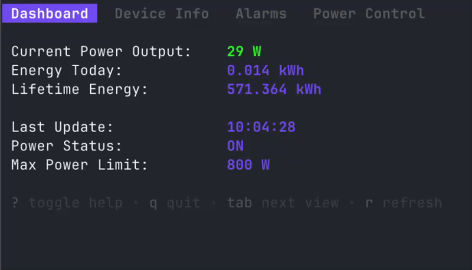

# APsystems EZ1 TUI


A terminal user interface (TUI) application for monitoring and controlling APsystems EZ1 microinverters, built with Go and [Bubbletea](https://github.com/charmbracelet/bubbletea).

## Features



- **Real-time Dashboard**: Monitor current power output, daily energy generation, and lifetime statistics
- **Device Information**: View detailed device specs including firmware, IP address, and serial number
- **Alarm Monitoring**: Check system health with alarm status for overvoltage, temperature, grid faults, and more
- **Power Control**: Remotely control device power status (ON/OFF/SLEEP) and adjust maximum power limits (30-800W)
- **Keyboard Navigation**: Intuitive keyboard controls for all operations

## Requirements

- Go 1.21 or higher
- APsystems EZ1-M microinverter with local API enabled
- Network access to the microinverter

## Installation

### From Source

```bash
git clone https://github.com/niclaszll/apsystems-ez1-tui.git
cd apsystems-ez1-tui
go build -o ez1-tui ./cmd/ez1-tui
```

### Using Go Install

```bash
go install github.com/niclaszll/apsystems-ez1-tui/cmd/ez1-tui@latest
```

## Setup Your Microinverter

Before using this application, you must enable the local API on your APsystems EZ1 microinverter:

1. Connect to the microinverter using the "Direct Connection" method in the APsystems app
2. Navigate to Settings → Local Mode
3. Enable local mode and select "Continuous"
4. Note the IP address displayed (you'll need this to run the application)

For detailed setup instructions with screenshots, see the [APsystems EZ1-API repository](https://github.com/SonnenladenGmbH/APsystems-EZ1-API).

## Usage

### Basic Usage

```bash
ez1-tui -host 192.168.1.100
```

### With Custom Port

```bash
ez1-tui -host 192.168.1.100 -port 8050
```

### Command-line Options

- `-host` (required): IP address or hostname of your microinverter
- `-port` (optional): API port number (default: 8050)

## Keyboard Controls

### Global Controls

- `Tab`: Switch between views (Dashboard → Device Info → Alarms → Power Control)
- `r`: Refresh data immediately
- `?`: Toggle help menu
- `q` or `Ctrl+C`: Quit application

### Power Control View

- `o`: Turn device ON
- `f`: Turn device OFF
- `s`: Set device to SLEEP mode
- `+` or `=`: Increase max power limit by 50W
- `-` or `_`: Decrease max power limit by 50W

## Architecture

The project is structured as follows:

```
.
├── cmd/
│   └── ez1-tui/          # Main application entry point
│       └── main.go
├── pkg/
│   └── apsystems/        # APsystems EZ1 API client library
│       ├── client.go     # HTTP client and request handling
│       ├── types.go      # Data structures for API responses
│       └── api.go        # API endpoint implementations
└── internal/
    └── tui/              # Terminal UI implementation
        └── tui.go        # Bubbletea model and views
```

## API Client Library

The `pkg/apsystems` package can be used independently as a Go client library for the APsystems EZ1 API:

```go
package main

import (
    "context"
    "fmt"
    "github.com/niclaszll/apsystems-ez1-tui/pkg/apsystems"
)

func main() {
    client := apsystems.NewClient("192.168.1.100", 8050)
    
    stats, err := client.GetStatistics(context.Background())
    if err != nil {
        panic(err)
    }
    
    fmt.Printf("Current Power: %d W\n", stats.TotalPower)
    fmt.Printf("Energy Today: %.3f kWh\n", stats.TotalEnergyToday)
}
```

### Available API Methods

- `GetDeviceInfo(ctx)`: Device details (serial, IP, firmware, etc.)
- `GetAlarmInfo(ctx)`: Alarm status for all monitored parameters
- `GetOutputData(ctx)`: Current power and energy readings
- `GetStatistics(ctx)`: Aggregated statistics from both PV inputs
- `GetMaxPower(ctx)`: Current maximum power limit setting
- `SetMaxPower(ctx, watts)`: Set maximum power limit (30-800W)
- `GetDevicePowerStatus(ctx)`: Current power status (ON/OFF/SLEEP)
- `SetDevicePowerStatus(ctx, status)`: Change power status

## Troubleshooting

### Connection Issues

If you can't connect to your microinverter:

1. Make sure the sun is shining
2. Verify the microinverter is on the same network
3. Check that local API mode is enabled (see Setup section)
4. Confirm the IP address is correct

## Contributing

Contributions are welcome! Please feel free to submit issues or pull requests.

## Credits

This project is based on the [APsystems-EZ1-API](https://github.com/SonnenladenGmbH/APsystems-EZ1-API) Python library by Sonnenladen GmbH. Special thanks to them for documenting the API.

## License

MIT License - see LICENSE file for details

## Disclaimer

This is an unofficial tool and is not affiliated with or endorsed by APsystems. Use at your own risk.
